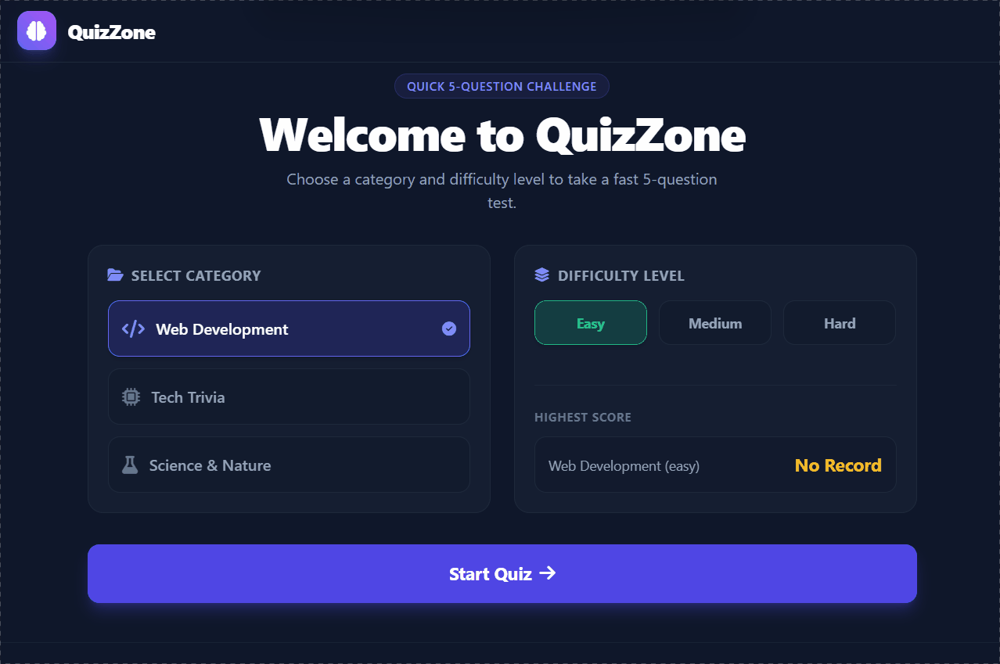

# Simple Quiz Application

A clean, modern, interactive web application designed for fast 5-question tests across various categories and difficulty levels.

## Features

- **Multiple Categories & Difficulties**: Web Development, Tech Trivia, and Science & Nature across Easy, Medium, and Hard.
- **5 Questions per Test**: Fast, targeted quizzes.
- **Animated Circular Timer**: Visual time indicator per question.
- **Detailed Explanations**: Instant feedback explaining correct answers.
- **Review Mode**: Complete breakdown of user answers vs correct options.
- **High Scores**: Persistent high scores saved using LocalStorage.
- **Keyboard Navigation**: Press `1-4` for choices, `Arrow` keys for navigation.

## Tech Stack

- **HTML5**: Semantic UI layout.
- **Tailwind CSS**: Modern utility-first styling.
- **JavaScript (ES6+)**: Object-oriented application logic.
- **Canvas Confetti**: Celebratory effects for high scores.

---

## Demo



---

## 📂 Project Structure

QuizZone/
├── index.html # Main HTML layout and structural components
├── styles.css # Custom CSS, scrollbar styles, and keyframe animations
├── questions.js # Structured question dataset (5 questions per category/difficulty)
├── app.js # Core application state engine and DOM controller
└── README.md # Project documentation

# Installation

1. Clone the repository

```bash
git clone https://github.com/ahsanstack/Quiz-Zone.git
```

2. Open the project folder.

3. Open `index.html` in your browser or run it using **Live Server** in Visual Studio Code.

---

## Author

**Ahsan**

- GitHub: https://github.com/ahsanstack

---
